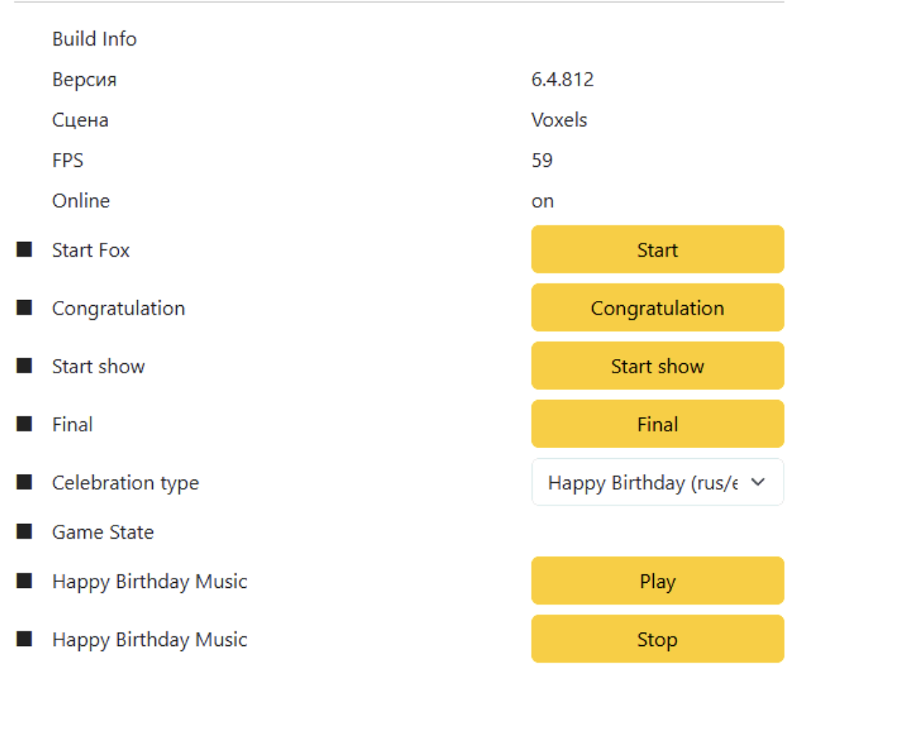

# Админка аниматора: сценарий ДР и функционал

Дата фиксации: 6 октября 2026 года.

## Источники и статус

- Пример сценария: «Фиджитал ДР Воксели .docx», предоставленный пользователем. Полный текст документа сохранён ниже; он описывает проведение праздника, а не инструкции разработчику.
- Текущий интерфейс: [исходный скриншот](current-admin.png).
- Назначение кнопок и последовательность подтверждены пользователем в чате.
- Основное устройство новой админки — **смартфон в портретной ориентации**. Планшет и компьютер — дополнительные форматы.
- Это описание исходных материалов и требований. Интеграция с оборудованием, API и автоматическое получение статусов пока не проверены.

Существующий PRODUCT.md — более широкая концепция. Его предположения о дополнительных режимах, таймерах и управлении оборудованием не считаются подтверждёнными функциями текущей админки. При проектировании основной последовательности ориентироваться на приведённые здесь источники и уточнения пользователя.

## Что должна помогать делать админка

Аниматор ведёт детей по сценарию и запускает цифровые события в нужные моменты. Интерфейс должен быстро отвечать на четыре вопроса: где мы сейчас, что сделать с детьми, что нажать и что произойдёт после нажатия.

Конструкция праздника общая для других тем; тексты, контент и маршрут инсталляций зависят от выбранного сценария. В данном примере персонаж называется **Лис Рокки**, праздник — **«Воксельный фестиваль»**.

## Основная последовательность управления

| Этап | Где и когда | Команда / действие | Результат |
|---|---|---|---|
| 1. Приветствие | Дети собрались в party room перед большим экраном | Start | На большом экране начинается вступительное обращение Рокки и завязка квеста. |
| 2. Квест в парке | После приветствия, знакомства и подготовки команды | Поочерёдный запуск нужных инсталляций — требование к новой админке | Каждая инсталляция должна запускаться с контентом выбранной темы праздника. Между инсталляциями аниматор проводит живые задания. |
| 3. Поздравление | Дети выполнили главный квест и вернулись в party room | Congratulations (на скриншоте Congratulation) | Рокки хвалит команду за победу и подводит к приключению на столе. |
| 4. Квест на столе | После поздравления, дети готовы играть за столом | Start Table (название из пояснения пользователя) | Запускается интерактивный квест на столе. |
| 5. Прощание | После победы в квесте на столе | Final | Запускается финальное прощание Рокки. |

**Музыка Happy Birthday управляется отдельно:** Play включает, Stop останавливает. Она не должна автоматически переводить праздник на следующий этап. В исходном сценарии музыка сопровождает сбор торта и вынос настоящего торта; автоматический запуск музыки существующей системой не подтверждён.

## Что видно на текущем скриншоте

| Элемент | Что известно |
|---|---|
| Build Info; Версия 6.4.812 | Технические сведения о сборке на момент снимка. |
| Сцена Voxels | Название сцены, отображённое в текущем интерфейсе. Не доказывает правильную тему на всех инсталляциях. |
| FPS 59 | Техническая метрика на момент снимка. |
| Online on | Отображаемый индикатор подключения. Не подтверждает доступность каждого устройства. |
| Start / Start Fox | По пояснению пользователя — старт вступления Рокки. |
| Congratulation | По пояснению пользователя — обращение Рокки после возвращения из парка. |
| Start show | Кнопка видна на скриншоте. Пользователь описал функцию запуска стола как Start Table. Соответствие Start show → Start Table нужно проверить перед интеграцией. |
| Final | По пояснению пользователя — финальное прощание после стола. |
| Celebration type | Выпадающий список; видно начало выбранного названия Happy Birthday (rus/…). Полный набор вариантов и их действие не установлены. |
| Game State | Подпись присутствует; значение и смысл не установлены. |
| Happy Birthday Music: Play / Stop | Отдельные команды включения и остановки праздничной музыки. |
| Чёрные квадраты слева | Назначение не установлено. Не считать их подтверждением выполнения этапов или готовности оборудования. |

Кнопок управления инсталляциями парка на этом снимке нет. Их наличие в другом интерфейсе или API не проверено.

## Пример маршрута: «Воксельный фестиваль»

Времена ниже взяты из сценария и служат ориентирами ведущему. Это не длительности медиафайлов и не основания автоматически переключать этапы.

| Порядок | Эпизод | Ориентир | Что делает ведущий / команда | Цифровое управление |
|---|---|---|---|---|
| 1 | Легенда в party room | 3 мин | Собрать детей за столом. Рокки знакомится с ними; Глитч ломает игры; дети соглашаются помочь. | Start: вступительное видео на большом экране. |
| 2 | Появление аниматора, знакомство и подготовка | 6 мин | Познакомиться, поздравить именинника, собрать мечи, открыть сундук с УФ-подсказкой и найти первый патч-код. | Отдельная команда оборудования в источнике не описана. |
| 3 | Бабл Мабл — раннер | 7 мин | Пройти уровень, собрать монеты, победить багов; получить патч «Фонари». | Новая админка: запуск тематической игры на этой инсталляции. |
| 4 | Качели — тест брони | 5 мин | Именинник становится Големом; команда тестирует броню воздушными шарами. Есть вариант без качелей. | Живое задание; отдельная цифровая команда не описана. |
| 5 | Фонари — Фрут Ниндзя | 6 мин | Два раунда игры; во втором команда направляет игроков с повязками голосом. | Новая админка: запуск тематической игры на этой инсталляции. Отдельная команда второго раунда не подтверждена. |
| 6 | Шифр | 5 мин | Расшифровать послание «Големы любят танцы». | Живое задание. |
| 7 | Танец Големов | 5 мин | Ведущий показывает движения; команда получает следующую подсказку. | В сценарии указана колонка; управление этой музыкой через админку не подтверждено. |
| 8 | Атака пауков | 5 мин | Показать сообщение Рокки на телефоне, провести игру с парашютом и шарами. | Видео на телефоне упомянуто в сценарии; команда админки для него не подтверждена. |
| 9 | Художник — вагонетка | 5 мин | Очистить препятствия кистями и победить багов; собрать карту из патчей. | Новая админка: запуск тематической игры на этой инсталляции. |
| 10 | Кидалки — финальная битва | 5 мин | Защитить деревню, победить Глитча и найти Кристалл Сервера. | Новая админка: запуск тематической игры на этой инсталляции. |
| 11 | Возвращение в party room | Не указано | Вернуть детей в комнату; Рокки поздравляет команду и отправляется за тортом. | Congratulations. |
| 12 | Квест на столе | Не указано | Помогать Рокки с ингредиентами и собирать праздничный торт. | Start Table. |
| 13 | Праздничный торт и музыка | Не указано | После сборки виртуального торта выносится настоящий торт. | Play / Stop для Happy Birthday; момент нажатия выбирает ведущий. |
| 14 | Прощание | Не указано | Завершить цифровую часть праздника. | Final. |

Порядок цифровых инсталляций: **Бабл Мабл → Фонари → Художник → Кидалки**. Живые задания между ними являются частью сценария и не должны исчезать из подсказок ведущему.

### Фазы квеста на столе

1. Рокки везёт ингредиенты на вечеринку.
2. Дети тапают по камням, расчищая дорогу вагонетке.
3. В мире багов дети строят защитные стены.
4. Собирают глитч-блоки для портала.
5. Отбивают атаку багов.
6. Сражаются с Глитчем.
7. Помогают вагонетке въехать в портал и вернуться домой.
8. Собирают рассыпавшиеся кусочки в праздничный торт.
9. Торт собран; музыка и вынос настоящего торта по сценарию.
10. Ведущий отдельно запускает Final — прощание.

Источник описывает игровые фазы, но не подтверждает необходимость ручной кнопки для каждой фазы. До проверки системы не добавлять отдельные команды их переключения.

## Требования к новому мобильному экрану

Это требования и предложения для проектирования, а не описание реализованных функций.

- Смартфон в портретной ориентации — приоритет. Первый макет проектировать для ширины около 390 CSS px и проверять на узком экране 360 CSS px.
- Вверху — выбранная тема и краткое обозначение текущего этапа. Полный маршрут раскрывается по запросу; не переносить пятиколоночный степпер на узкий экран.
- На первом экране — «Соберите детей в party room», короткое объяснение результата и одна главная кнопка «Запустить приветствие Рокки».
- На каждом следующем этапе — место, одно-два действия ведущего, понятная кнопка запуска и краткое «Что дальше».
- Названия действий на русском: «Запустить приветствие», «Запустить поздравление», «Запустить квест на столе», «Запустить прощание».
- Основная кнопка на всю доступную ширину, высотой ориентировочно 56–64 CSS px. Элементы должны удобно нажиматься на ходу одной рукой.
- Музыка доступна независимо от этапа через компактный блок; при необходимости он раскрывает отдельные «Включить» и «Остановить».
- Разделять запуск контента и отметку завершения этапа. Просмотр следующего шага не должен запускать оборудование.
- Пока нет достоверного события завершения от системы, окончание видео или игры отмечает ведущий. Нажатие Start или истечение рекомендованного времени не означает завершение.
- Статусы различают отправленную команду, подтверждённый запуск и ошибку. Без ответа оборудования не показывать «Игра запущена» или «Устройство готово» как факт.
- На этапе парка запускать конкретную инсталляцию с контентом выбранного праздника. Требуется механизм выбора нужной темы, поскольку сейчас на инсталляции может стоять другая.
- Полный текст ведущего и реквизит раскрываются по запросу. Основной экран содержит короткую шпаргалку.
- Версию, FPS и прочие технические сведения убрать в отдельный раскрываемый раздел.
- Общая конструкция интерфейса должна работать для разных тематических праздников через данные сценария, без привязки всех текстов и команд к воксельному примеру.

## Что проверить перед интеграцией

1. Действительно ли Start show на текущем экране запускает стол, описанный пользователем как Start Table.
2. Какие команды и идентификаторы темы поддерживает каждая из четырёх инсталляций; как подтверждается фактическое переключение контента.
3. Есть ли события старта и окончания видео, завершения игры и победы на столе.
4. Что означает Game State, индикаторы слева и какие варианты доступны в Celebration type.
5. Как работают повторный запуск и ошибки команд; есть ли поддерживаемые остановка или пауза видео/игр. Наличие Stop для музыки не доказывает наличие остановки других событий.
6. Играет ли музыка после сборки торта автоматически и как это сочетается с отдельными Play / Stop.

## Полный текст предоставленного сценария

Ниже — текст из DOCX в исходном порядке абзацев. Формат таблиц, изображения и оформление Word не воспроизводятся. Редакционные заметки и повторы сохранены как часть источника; они не являются дополнительными требованиями к программным функциям.

> Сценарий проведения фиджитал Дня Рождения "Воксельный Фестиваль"

> Действие

> Механика этапа

> Текст аниматора:

> Текст ролика

> Реквизит

> Легенда. (Пати рум, 3 минуты)

> Детей собирает в пати рум персонал. Дети садятся за стол. Персонал включает заставку с Лисом Рокки

> ЛИС РОККИ (ВИДЕО): "Приве-е-ет, крафтеры! Меня зовут Лис Рокки, и добро пожаловать на мой стрим! А как вас зовут?" (пауза 3 сек)

> Видео с Лисом.

> "Супер, приятно познакомиться! Я как раз хотел постримить свои любимые но... Ой, что это?" (Экран начинает "глючить", покрываться пикселями).

> ГЛИТЧ (ВИДЕО): "Ха-ха-ха! Этот парк теперь мой! Я — Глитч, и я сломал все ваши игры! Никакого стрима не будет!"

> ЛИС РОККИ (ВИДЕО): "О нет! Он забаговал весь мир! Ребята, вы должны мне помочь! Мне нужна команда лучших Дебаггеров (проработать  еще варианты), чтобы починить игры! Вы справитесь?" (Пауза 3 сек)

> "Тогда я спавню (создаю) вам моего лучшего помощника! Закрывайте глаза и считайте до 10. Один, два... десять!"

> Появляется аниматор, знакомство. (6 минут)

> Аниматор появляется в

> "Ого! Вот это спавн! Всем привет, команда!! Я ваш главный Модератор в этом мире .

> Колонка с музыкой

> Аниматор знакомится с детьми и поздравляет именинника.

> "Прежде чем мы отправимся спасать игры от багов, нам нужно познакомиться! Придумайте себе никнеймы и расскажите, кто готов первым крафтить победу?" (Дети представляются)

> Аниматор раздает детям ШДМ (шары для моделирования) или неоновые палочки.

> "Отлично! Добро пожаловать в команду, Имя именинника — наш главный Крафтер! Теперь вам нужна экипировка. Чтобы отправиться в забагованный мир и побеждать багов”, нам нужно оружие. Берите эти ресурсы и давайте скрафтим себе Пиксельные Мечи!" (Аниматор раздает всем шары/палочки и показывает, как собрать меч).

> ШДМ (Шары для моделирования) или неоновые палочки (под "мечи").

> Аниматор показывает сундучок. Пароль (например, "123") заранее написан УФ-ручкой на стульях или стене.

> "Друзья, Глитч украл Кристалл Сервера, который лечит все игры. Но он оставил заглюченный сундудук с подсказкой. Тут замок! Как же его открыть..." (Переворачивает сундук, видит пустой лист).

> Сундук с цифровым замком. УФ-ручка ("Факел").

> "Ага! Забагованное послание! Но тут ничего нет... Хм... попробуем использовать УФ-Факел!" (Аниматор достает УФ-ручку, светит на лист. Появляется надпись "Код в этой локации").

> Дети открывают сундучок и находят первый "Патч-Код" (кусочек карты).

> "Вот оно! Код спрятан где-то здесь! Ищите три цифры!" (Дети с "Факелом" ищут код, открывают сундук, получают первый Патч-Код).

> 1-й "Патч-Код" (кусочек карты) с надписью "БАБЛ МАБЛ".

> Аниматор строит детей в "вагонетку".

> "Отлично! Первый патч у нас! Он ведет в игру Бабл Мабл! Ребята, важное правило: по миру мы передвигаемся только на нашей вагонетке! Держитесь друг за друга! Поехали!! Чух-чух-чух... Поехали!" (Дети "паровозиком" едут в парк).

> Бабл Мабл (Раннер) (7 минут)

> Участники отправляются в игру (аналог Subway Surfer). Задача — "пробежать" уровень, собрать монеты, победить боссов.

> "Мы на месте! Это мой любимый раннер, но Глитч заспавнил тут кучу багов! Имя Именинника, веди команду! Нужно пробежать этот уровень и уничтожить всех багов

> Аниматор "находит" 2-й "Патч-Код".

> "Круто пробежали! Вы починили раннер! Смотрите, из босса выпал... второй Патч-Код!" (Аниматор "находит" 2-й Патч-Код "ФОНАРИ").

> 2-й "Патч-Код" ("ФОНАРИ").

> Качели. (Тест Брони) (5 минут)

> Аналог "Метеоритного дождя". Именинник ("Железный Голем") садится на качели. Гости ("Дебаггеры") "тестируют" его "броню".

> Отлично, команда! Наш следующий патч ведет в игру Фонари! Быстро, все в вагонетку!" (Дети собираются). "О нет! Ребята, наша вагонетка не может ехать! Глитч заспавнил целую толпу Криперов! Нам нужен герой, который защитит вагонетку! Имя Именинника, ты будешь нашим Железным Големом! Но твоя броня готова? Команда Дебаггеров, нам нужно протестировать броню нашего Голема! Кидаем в него блоки (зеленые шары)! Посмотрим, выдержит ли он атаку!"

> Шары для моделирования (ШДМ).

> Имениннику делают "броню" из ШДМ и сажают на качели. Дети и аниматор кидают в него "Криперов" (зеленые воздушные шары).

> (Именинника сажают на качели, он отбивает "тестовые блоки" (шары). Дети-гости кидают шары, "тестируя" броню). "Молодец, Имя! Ты наш Железный Голем! Броня скрафчена идеально! Ты спас нас!"

> Зеленые воздушные шары (10-15 шт).

> (Вариант без качелей): Именинник в центре, дети (с ШДМ-мечами) вокруг него. Аниматор кидает шары, дети должны их отбивать.

> "Теперь мы можем ехать дальше! Все по вагонеткам! Наш следующий патч ведет в игру Фонари!"

> Фонари (Фрут Ниндзя) (6 минут)

> Участники подходят к игре. Задача — "мечом" (фонарем) резать фрукты и баги, но не трогать бомбы.

> "Мы в игре Фрут Ниндзя! Но Глитч все забаговал! Он смешал полезные фрукты со своими багами и бомбами! Будьте внимательны! Режем все, КРОМЕ БОМБ!"

> Игра проходит в 2 раунда. 1. Дети просто играют. 2. (Пояснение для аниматора: выбери 1-2 детей, надень маски. Остальные дети должны активно помогать, направляя "слепых" игроков криками "Левее!", "Правее!", "Режь!").

> (После 1 раунда) "Внимание! Глитч наслал на нас эффект Слепоты! Он выбрал своих жертв! Имя 1 и Имя 2, на вас эффект!" (Аниматор надевает им маски). "Команда Дебаггеров, вы теперь — поводыри! Вы должны вести наших ослепленных героев! Подсказывайте им голосом, куда бить мечом! Работаем в команде!"

> Маски на глаза (2 шт).

> Игра "Шифр" (5 минут)

> Аниматор: "Отлично починили! Смотрите, Глитч дропнул (уронил) табличку!" (Находит конверт с шифром).У аниматора есть два листа - один с переводом шифра, второй с посланием.

> "А вот и послание от Глитча! Но оно зашифровано шифром! Давайте попробуем его расшифровать..." (Дети разгадывают).

> Конверт с зашифрованным посланием. Карточка с расшифровкой (Надпись: "ГОЛЕМЫ ЛЮБЯТ ТАНЦЫ").

> "Ого, тут написано... Големы любят танцы! Кажется, я знаю, как активировать следующий патч! Мы должны устроить Танец Железных Големов!"

> Дискотека "Танец Големов" (5 минут)

> Дискотека 5 минут. Аниматор показывает квадратные, "блочные" движения (как робот или голем из Майнкрафта).

> "Повторяйте за мной! Руки-блоки, ноги-блоки! Крафтим лучший танец!" (В конце танца "находит" следующий патч-код). "Есть! Отправляемся дальше, в Художника!"

> Колонка. 3-й "Патч-Код" ("ХУДОЖНИК").

> (Атака Пауков) (5 минут)

> Аналог "Парашюта". Аниматор достает телефон с видео от Рокки.

> "Ребята, на связи Рокки с важным сообщением!"

> Лис (Видео): "Ребята, тревога! Глитч узнал, что вы чините игры, и заспавнил целую армию Пещерных Пауков! Приготовьтесь к защите! Я дропнул вам Щит-Паутину!"

> Ролик на телефоне аниматора.

> Аниматор дает детям парашют. Кидает шарики (пауков), дети отбивают. В финале прячутся под "щит".

> "Быстро, берите Щит-Паутину! Отбиваем пауков (черные шарики)!" (В конце) "Прячемся! Финальная атака!" (Дети прячутся под парашют).

> Парашют и шарики (черные, 10 шт). 4-й "Патч-Код" (Художник).

> "Мы победили! Молодцы, команда! Следующая точка... Художник!"

> Художник (Вагонетка) (5 минут)

> Игра "Художник". Вагонетка едет по рельсам. Задача — "очищать" (раскрашивать) препятствия и "лопать" багов большими кисточками.

>  Смотрите, вагонетка не может проехать, путь забагован! Берите Кисти-Очистители и дебажим блоки! Лопайте мелких багов!"

> После игры аниматор вручает последний "Патч-Код". Дети соединяют все "патчи" (карту).

> "Супер! Мы починили рельсы! Ребята, смотрите, последний Патч-Код!" (Дает 5-й "Патч-Код"). "Давайте соберем все патчи вместе... Я понял! Логово Глитча в игре Кидалки! Он захватил Деревню Жителей!"

> 5-й "Патч-Код" ("Логово Глитча").

> (Кидалки + Финальная битва) (5 минут)

> "Кидалки". Баги идут на деревню. Задача — защитить ее.

> Глитч где-то рядом! Он спавнит багов, чтобы сломать деревню! Готовы дать отпор? Кидаем в них шарики!"

> В конце появляется сам Глитч (Босс).

> Дети сражаются с Глитчем). Давайте, команда! Еще немного! Мы почти починили игру!

> После победы Глитч роняет артефакт. Аниматор прячет "Картридж" в шариках.

> "Ура! Злодей разлогинился с позором! Ребята, вы молодцы! Смотрите, он дропнул Кристалл Сервера! Скорее, ищите его в шахте (бассейне с шариками)!"

> "Кристалл Сервера" (физический реквизит).

> Финал программы в пати рум.

> Аниматор: "Мы починили сервер! Пора возвращаться в пати рум, загружать Кристалл и праздновать! Все в вагонетку!"

> Ребята, вы просто супер! Победив Глитча, вы заслужили настоящий праздник! Я отправляюсь в воксельный мир, чтобы привезти вам торт, который будет в самый раз для такого великого праздника! Увидимся совсем скоро!

> Видео с Лисом (запускает оператор).

> Стол

> Фазы стола

> Что делают дети

> Текст Рокки на экране

> Начало

> Я везу ингредиенты для огромного праздничного торта на нашу супер-вечеринку! Помогите мне доставить их!

> Локация 1

> На дороге есть препятствия, дети тапают по ним, чтобы вагонетка проехала

> О нет! Что-то не так… Проезд завален камнями! Ребята, помогите мне расчистить дорогу! Тапайте по камням на столе, разбейте их!

> Локация 2. Строим стену

> Тапают по блокам, чтобы построить стену

> Фух… Кажется, мы приземлились.. Но похоже мы попали в мир багов!

> Ребята, нам нужно защитить тележку и ингредиенты для торта! Давайте построим вокруг нас стены! Тапайте по блокам вокруг острова!

> Локация 2. Глитч блоки

> Тапают по глитч блокам, чтобы построить портал

> Смотрите, в небе летают глитч-блоки. Давайте добудем их! Тапайте по летающим блокам, чтобы построить портал!

> Локация 2. Атака багов

> Тапают по багам

> Ребята, смотрите — баги вылезают повсюду и бегут к нашим стенам и тележке! Не давайте им пройти! Тапайте по багам!

> Локация 2. Атака Глитча

> Должны затапать Глитча

> Вы это слышите?..Это… ГЛИИИТЧ! Он вернулся, чтобы испортить наш праздник!

> Тележка готова, ингредиенты на месте… Пора домой! Запрыгиваем в портал! На счёт три! Раз… два… три!

> Локация 2. Возвращение домой

> Тапают по столу, чтобы вагонетка заехала в портал

> Тележка готова, ингредиенты на месте… Пора домой! Запрыгиваем в портал! На счёт три! Раз… два… три!

> Локация 3. Сбор торта

> Тапают по кусочкам торта, чтобы собрать торт

> Посмотрите, все коробки на тележке открылись, и кусочки торта рассыпались по всей карте! Нам нужно собрать их в один огромный праздничный торт!

> Локация 3. Финал

> Играет музыка и выносится торт

> Готово! Наш праздничный торт собран! Вы невероятные!

> Прощание (запускается по кнопке Final)

> Спасибо вам, команда! Вы спасли праздник, победили всех багов и Глитча! И создали потрясающий торт! Ну а я прощаюсь с вами. До встречи в Хелоу Парк! Пока-пока!
